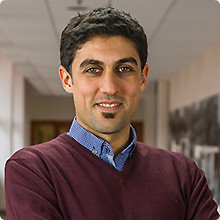

<h3> Ginevra Castellano </h3>
<h4 style="color:grey"> Associate Professor </h4>
<h4 style="color:grey"> Lab Director </h4>

    

		
    
  
    

    
 Ginevra Castellano is an Associate Professor at the Department of Information Technology, Uppsala University, where she leads the Social Robotics Lab. Her research interests are in the areas of social robotics and affective computing, and include social learning, personalized adaptive robots, multimodal behaviours and uncanny valley effect in robots and virtual agents. Over the last ten years she has been working on the development of computational abilities that allow robots to behave in a socially intelligent way in scenarios where robots provide social support to humans, for example as tutors in the classroom or as companions for children.

    

<button class="button black" onclick="window.open(''http://user.it.uu.se/~ginca820/')" type="button">
	Ginevra Castellano's Personal Website</button>

<h3> Maike Paetzel </h3>
<h4 style="color:grey">  Ph.D. Candidate </h4>

    

		
    
  
    

    
 Maike Paetzel is a PhD student in the Social Robotics Lab and mainly focused on studying the uncanny valley effect. She is specifically interested in how interactions with an agent can change an initial (uncanny) perception. Maike’s background is both in humanoid robotics and conversational agents. Apart from Human-Robot Interaction her heart belongs to the RoboCup community, where she is still actively engaged in the team Hamburg Bit-Bots and the organization of the Humanoid League.

    

<button class="button black" onclick="window.open('https://maike-paetzel.de/')" type="button">
	Maike Paetzel's Personal Website</button>

<h3> Alex Yuan Gao </h3>
<h4 style="color:grey">  Ph.D. Candidate </h4>

    

		
    
  
    

    
 Alex Yuan Gao is a Ph.D. candidate, who wants to live in a world filled with innovative businesses, robots, books that come bundled with extra hot chocolate and a steampunk-styled force field around his keyboard that repels cats. He is interested in machine learning, as applied to (social) robotics. In particular, he is interested in deep/reinforcement/neuro-based learning approaches to robotic perception, control, and physical modeling of the robot's environment. Currently, he is working on projects that can fill the gap between deep reinforcement learning and social robotics.

    

<button class="button black" onclick="window.open('http://yuangao.ai')" type="button">
	Yuan Gao's Personal Website</button>

<h3>Sebastian Wallkötter</h3>
<h4 style="color:grey">  Ph.D. Candidate </h4>

    

		
    
  
    

    
 Sebastian Wallkötter is a PhD student at the Department of Information Technology, Uppsala University, and works as a researcher in the Social Robotics Lab. His work is part of the Horizon 2020 funded ANIMATAS project. He is interested in social learning for robots, ethical behavior of robotic systems as well as advancing the field of machine learning in the areas of reinforcement learning and deep learning.

    

<button class="button black" onclick="window.open('http://sebastian.wallkoetter.net')" type="button">
	Sebastian Wallkötter's Personal Website</button>

<h3>Mohammad Obaid</h3>
<h4 style="color:grey"> Visiting Researcher </h4>

    

		
    
  
    

    
 Dr. Mohammad Obaid received his BSc., MSc. (First Class Honors) and Ph.D. degrees in Computer Science from the University of Canterbury, Christchurch, New Zealand, in 2004, 2007 and 2011, respectively. He worked at several international research centers including the Human Centered Multimedia Lab (HCM Lab), University of Augsburg (Germany), the Human Interface Technology Lab New Zealand (HITLab NZ), University of Canterbury (New Zealand), and the t2i Lab, Chalmers University of Technology (Sweden). In 2016, he joined the the Social Robotics Lab, Department of Information Technology, Uppsala University (Uppsala, Sweden) as a researcher.

    

<button class="button black" onclick="window.open('https://http://t2i.se/mohammad-obaid/')" type="button">
	Mohammad Obaid's Personal Website</button>
