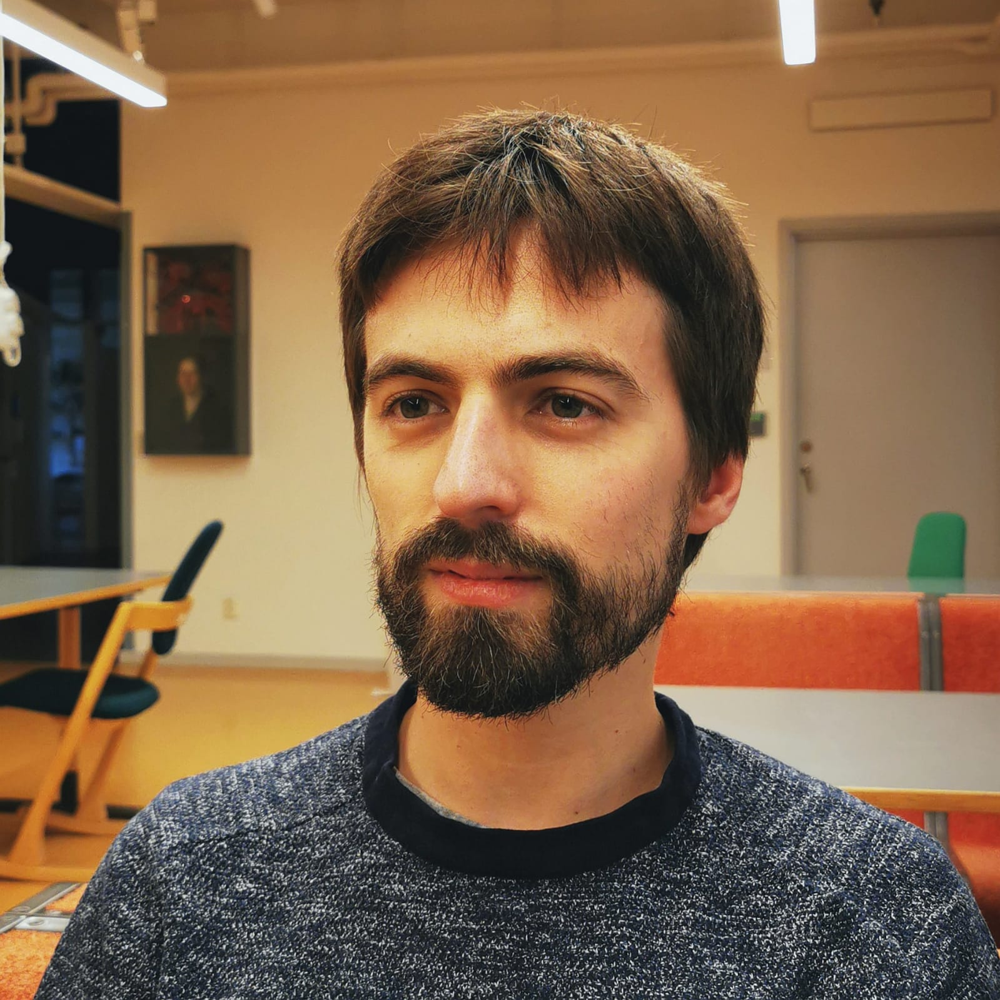
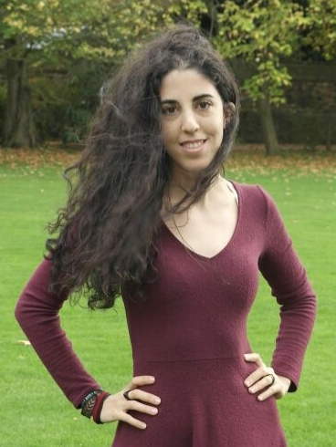
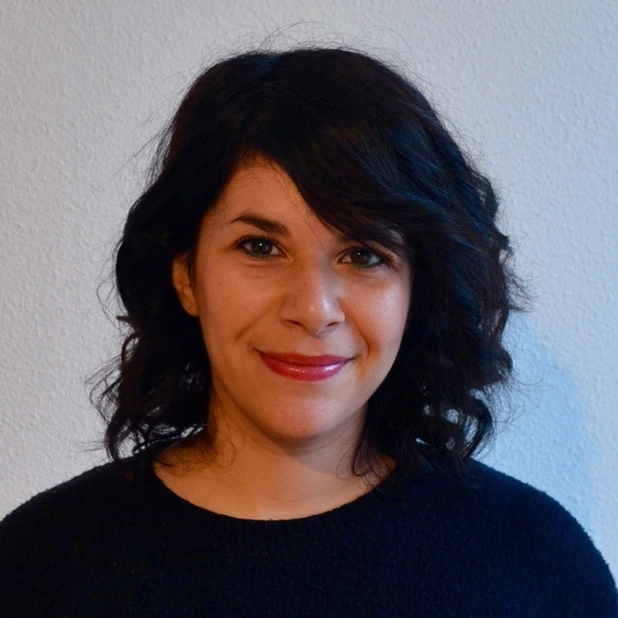

<h3> Ginevra Castellano </h3>
<h4 style="color:grey"> Professor </h4>
<h4 style="color:grey"> Lab Director </h4>

    

		
    
  
    

    
 Ginevra Castellano is a Professor at the Department of Information Technology, Uppsala University, where she leads the Social Robotics Lab. Her research interests are in the areas of social robotics and affective computing, and include social learning, personalized adaptive robots, multimodal behaviours and uncanny valley effect in robots and virtual agents. Over the last ten years she has been working on the development of computational abilities that allow robots to behave in a socially intelligent way in scenarios where robots provide social support to humans, for example as tutors in the classroom or as companions for children.

    

<button class="button black" onclick="window.open('http://user.it.uu.se/~ginca820/')" type="button">
	Ginevra Castellano's Personal Website</button>

<h3>Sebastian Wallkötter</h3>
<h4 style="color:grey">  Ph.D. Candidate </h4>

    

		
    
  
    

    
 Sebastian Wallkötter is a PhD student at the Department of Information Technology, Uppsala University, and works as a researcher in the Social Robotics Lab. His work is part of the Horizon 2020 funded ANIMATAS project. He is interested in social learning for robots, ethical behavior of robotic systems as well as advancing the field of machine learning in the areas of reinforcement learning and deep learning.

    

<button class="button black" onclick="window.open('http://sebastian.wallkoetter.net')" type="button">
	Sebastian Wallkötter's Personal Website</button>
	
	
<h3>Natalia Calvo</h3>
<h4 style="color:grey">  Ph.D. Candidate </h4>

    

		
    
  
    

    
 Natalia Calvo is a Ph.D. student in the Social Robotics Lab. She believes in a world where robots can actively assist humans in different scenarios.  Her work is focused on modeling trust in human-robot educational interactions, and it is part of the ANIMATAS Project funded by Horizon 2020. Her research interests cover deep learning and human-robot interaction towards an interdisciplinary approach mostly focused on manipulation tasks, speech recognition interfaces, computer vision, and social robotics.    

<button class="button black" onclick="window.open('https://www.it.uu.se/katalog/natca979')" type="button">
	Natalia Calvo's Personal Website</button>	

<h3>Marc Fraile</h3>
<h4 style="color:grey">  Ph.D. Candidate </h4>

    

		
    

    

    
 Marc Fraile is a Ph.D. candidate under the Centre for Interdisciplinary Mathematics (CIM) at Uppsala University. He conducts his research in Uppsala Social Robotics Lab, in close collaboration with the Methods for Image Data Analysis (MIDA) group. His interests lie in developing explainable AI (XAI) methods, and applying those to make more trustable machines. 

<button class="button black" onclick="window.open('https://www.it.uu.se/katalog/marfr327')" type="button">
	Marc Fraile's Personal Website</button>

<h3>Mengyu Zhong</h3>
<h4 style="color:grey">  Ph.D. Candidate </h4>

    

		
    

    

    
 Mengyu Zhong is a PhD student in the Social Robotics Lab. She received an MSc in IT and Cognition from the University of Copenhagen in 2021. She believes that AI-powered robots are changing the world and will free humans from trivial and repetitive works. Her work is focused on data-driven socially assistive robotics, and it is part of the Project funded by WoMHeR. She is interested in human-robot interaction, multi-modal deep learning, and especially robot-assisted medical diagnosis. 

<button class="button black" onclick="window.open('https://www.it.uu.se/katalog/menzh316')" type="button">
	Mengyu Zhong's Personal Website</button>

<h3>Elena Lechuga Redondo</h3>
<h4 style="color:grey">  Visiting Ph.D. Student </h4>

    

		
    

    

    
 Elena Lechuga Redondo is a PhD student of the Robotics Brain and Cognitive Science (RBCS) department at the Italian Institute of Technology (IIT). Her main interests are social robotics and affective computing. Ideally, she would like to merge both and create robots able to recognize and adapt to the most relevant paterns within an interaction. Eager on getting deeper in this research, she started a collaboration with the Ginevra Castellano's group in the Social Robotics Lab at Uppsala University. 

<button class="button black" onclick="window.open('http://www.it.uu.se/katalog/marle917')" type="button">
	Elena Lechuga's Personal Website</button>
	

	
<h2 style="color:grey"> Alumni  </h2>
<h3> Maike Paetzel </h3>
<h4 style="color:grey">  Ph.D.</h4>

	
<h3> Alex Yuan Gao </h3>
<h4 style="color:grey">  Ph.D. </h4>

    

		
    
  
    

    
 (Alex) Yuan Gao is a former PhD student in the Social Robotics Lab at Uppsala University. His research interests are driven by a final goal of developing AI-driven robots that can think and feel like real humans (e.g. Ex Machina). This encircles robot's learning and control, nature language processing, image processing, neuroscience and computational phycology. In particular, he is interested in deep/reinforcement/neuro-based learning approaches to robotic perception, control, and physical modeling of the robot’s environment, which can help us to understand ourselves and build a unified learning structure for adaptive, efficient and robust complex robotic system. Currently, he is working on projects that can fill the gap between deep reinforcement learning and social robotics.

    

<button class="button black" onclick="window.open('http://yuangao.ai')" type="button">
	Yuan Gao's Personal Website</button>

<h3> Giulia Perugia </h3>
<h4 style="color:grey">  Postdoc Researcher </h4>

    

		
    
  
    

    
 Giulia Perugia is a formera postdoctoral researcher in the Social Robotics Lab. She received a BA in Literature and Linguistics from the University of Roma Tre (Rome, Italy) in 2011, a MSc in Cognitive Science from the University of Siena (Italy) in 2013, and a double degree PhD in Assistive Technologies from the Polytechnic University of Catalonia (UPC; Barcelona, Spain) and Eindhoven University of Technology (TU/e; Netherlands) in 2018. As a scientist, she is interested in understanding and modeling the emotional and social linkage that the interaction with social robots triggers, how this can be used for assistive and educational purposes, and how it might impact and shape our society. 

    

<button class="button black" onclick="window.open('http://katalog.uu.se/profile/?id=N18-2160')" type="button">Giulia Perugia's Website</button>

<h3>Piercosma Bisconti Lucidi</h3>
<h4 style="color:grey">  Visiting Ph.D. Student </h4>

    

		
    

    

    
 Piercosma Bisconti is a former visiting Ph.D. student in the Social Robotics Lab. He is a Ph.D. candidate in Political Philosophy at Sant’Anna School of Advanced Studies. His research focuses on how human-robot interactions may influence human-human ones, especially with regards to Social Robotics. His background is in Philosophy, both the B.A and M.A, and a large part of his studies focused on Psychology. While doing his Ph.D, he is researcher at the CyberethicsLab, addressing the socio-technical implications of disruptive technologies in EU Horizon 2020 projects. 

