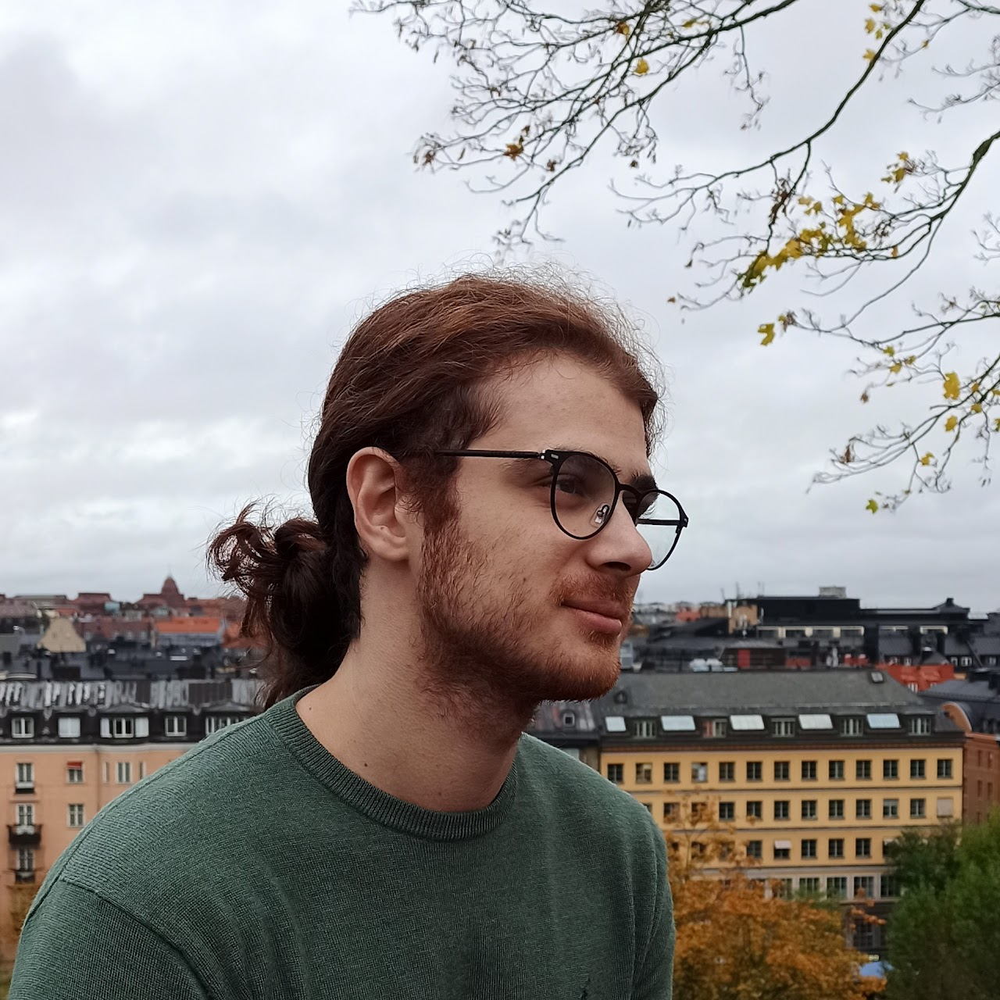
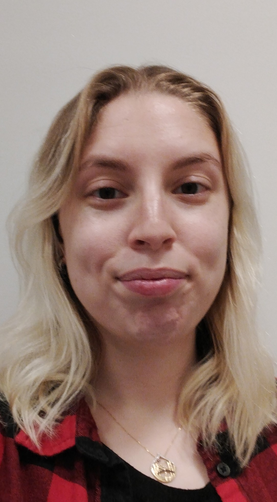

<h3> Ginevra Castellano </h3>
<h4 style="color:grey"> Professor </h4>
<h4 style="color:grey"> Lab Director </h4>

    

		
    
  
    

    
 Ginevra Castellano is a Professor at the Department of Information Technology, Uppsala University, where she leads the Social Robotics Lab. Her research interests are in the areas of social robotics and affective computing, and include social learning, personalized adaptive robots, multimodal behaviours and uncanny valley effect in robots and virtual agents. Over the last ten years she has been working on the development of computational abilities that allow robots to behave in a socially intelligent way in scenarios where robots provide social support to humans, for example as tutors in the classroom or as companions for children.

    

<button class="button black" onclick="window.location.href='../ginevra/'" type="button">
	Ginevra Castellano's Personal Website</button>

<h3> Katie Winkle </h3>
<h4 style="color:grey"> Assistant Professor </h4>

    

		
    
  
    

    
 Katie Winkle is an Assistant Professor at the Department of Information Technology, Uppsala University, where she is developing new lines of research around trustworthy Human Robot Inteaction (and what that means) at the Social Robotics Lab. Her research interests cover the design, development, evaluation and application of socially assistive robotics, with a focus on human-in-the-loop design/development and mutual shaping approaches which recognise the two-way interaction between robots and society. 

    

<button class="button black" onclick="window.open('https://kwinkle.github.io/')" type="button">
	Katie Winkle's Personal Website</button>

<h3> Ana Tanevska </h3>
<h4 style="color:grey"> Postdoctoral Researcher </h4>

    

		
    
  
    

    

Ana Tanevska is a postdoctoral researcher at the Department of Information Technology, Uppsala University, within the Horizon Europe project SymAware. Their research at the Social Robotics Lab is grounded in the topic of trustworthy human-robot interaction with a particular focus on human-in-the-loop learning and shared autonomy and agency in HRI. In addition to trustworthy HRI, Ana's research interests also include cognitive robotics (with a spotlight on the role of affect in cognition) and socially-assistive HRI.
    

    

<button class="button black" onclick="window.open('https://www.it.uu.se/katalog/anata621')" type="button">
	Ana Tanevska's Personal Website</button>

<h3>Natalia Calvo</h3>
<h4 style="color:grey">  Ph.D. Candidate </h4>

    

		
    
  
    

    
 Natalia Calvo is a Ph.D. student in the Social Robotics Lab. She believes in a world where robots can actively assist humans in different scenarios.  Her work is focused on modeling trust in human-robot educational interactions, and it is part of the ANIMATAS Project funded by Horizon 2020. Her research interests cover deep learning and human-robot interaction towards an interdisciplinary approach mostly focused on manipulation tasks, speech recognition interfaces, computer vision, and social robotics.    

<button class="button black" onclick="window.open('https://www.it.uu.se/katalog/natca979')" type="button">
	Natalia Calvo's Personal Website</button>	

<h3>Marc Fraile</h3>
<h4 style="color:grey">  Ph.D. Candidate </h4>

    

		
    

    

    
 Marc Fraile is a Ph.D. candidate under the Centre for Interdisciplinary Mathematics (CIM) at Uppsala University. He conducts his research in Uppsala Social Robotics Lab, in close collaboration with the Methods for Image Data Analysis (MIDA) group. His interests lie in developing explainable AI (XAI) methods, and applying those to make more trustable machines. 

<button class="button black" onclick="window.open('https://marcfraile.github.io/')" type="button">
	Marc Fraile's Personal Website</button>

<h3>Mengyu Zhong</h3>
<h4 style="color:grey">  Ph.D. Candidate </h4>

    

		
    

    

    
 Mengyu Zhong is a PhD student in the Social Robotics Lab. She received an MSc in IT and Cognition from the University of Copenhagen in 2021. She believes that AI-powered robots are changing the world and will free humans from trivial and repetitive works. Her work is focused on data-driven socially assistive robotics, and it is part of the Project funded by WoMHeR. She is interested in human-robot interaction, multi-modal deep learning, and especially robot-assisted medical diagnosis. 

<button class="button black" onclick="window.open('https://www.it.uu.se/katalog/menzh316')" type="button">
	Mengyu Zhong's Personal Website</button>

	
<h3>Lux Miranda</h3>
<h4 style="color:grey">  Ph.D. Candidate </h4>

    

		
    

    

    
 Lux Miranda is a PhD student in the Social Robotics Lab. She wants to use the power of ethics, AI, and robotic embodiment to remedy existential dangers and transform society into a more sustainable and compassionate place. With a background drawing from complexity science, anthropology, cognitive science, and computational modeling, their current work is focused on the ethics and diversification of robot identity construction, AI alignment, feminist robot design, the dynamics of social intelligence, and illuminating the world. 

<button class="button black" onclick="window.open('https://luxmiranda.com/')" type="button">
	Lux Miranda's Personal Website</button>
	

<h3>Alessio Galatolo</h3>
<h4 style="color:grey">  Ph.D. Candidate </h4>

    

		
    

    

    
 Alessio Galatolo is a PhD student at the Social Robotics Lab. He received his MSc degree in Machine Learning at KTH, Stockholm in 2022. His work directly targets diabetes prevention using social robots as part of the PREVENT project. His research interests involve the use of AI and ML to give robots the social intelligence needed to personalise and improve their interaction to a specific user, also considering the ethical risks and social consequences involved. 

<button class="button black" onclick="window.open('https://www.alessiogalatolo.com/home-page')" type="button">
	Alessio Galatolo's Personal Website</button>
	

<h3> Anastasia Akkuzu</h3>
<h4 style="color:grey"> Master's student </h4>

    

		
    
  
    

    

Anastasia Akkuzu is a Master's student in Human-Computer Interaction writing her thesis at the Social Robotics Lab under the supervision of Natalia Calvo. She is researching how relationships between humans and robots take form, especially in the contexts of emotional intimacy and uncanniness. Her background is in cognitive science with interests in AI, cognitive computing, many-valued logic, and robotics.
    

    

	
<h2 style="color:grey"> Alumni  </h2>
<h4> Sebastian Wallkötter, Ph.D. </h4>
<h4> Maike Paetzel, Ph.D. </h4>
<h4> Yuan Gao, Ph.D. </h4>
<h4> Giulia Perugia, Postdoc </h4> 
<h4> Piercosma Bisconti Lucidi, Visiting Ph.D. </h4> 
<h4> Elena Lechuga Redondo, Visiting Ph.D. </h4>

