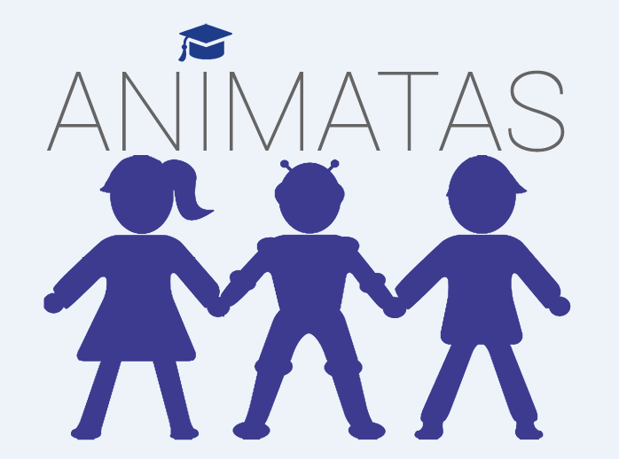
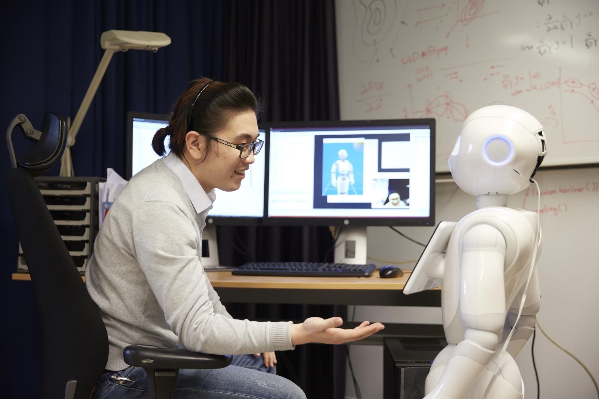
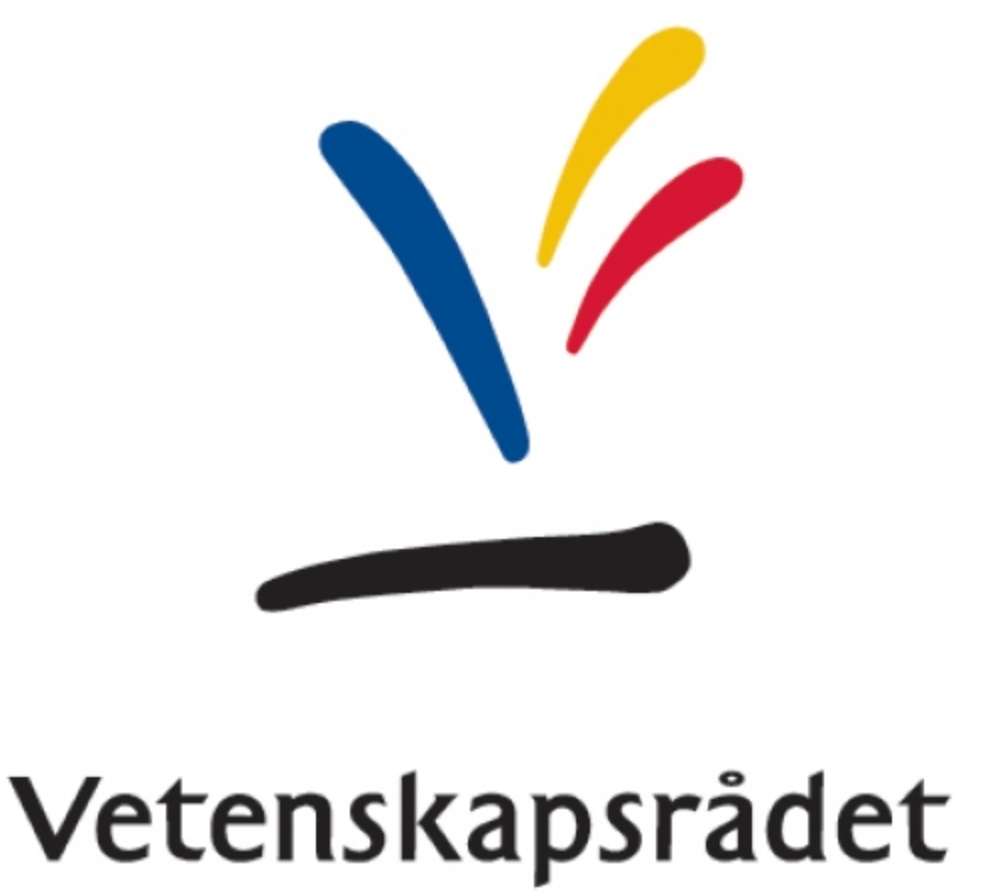
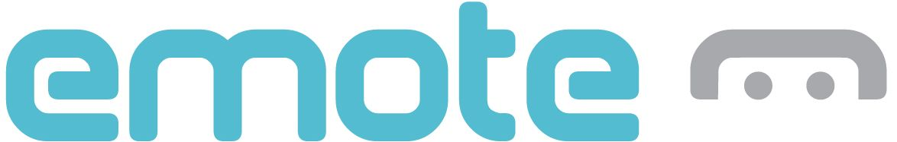

    

		
    
  
    

		<a href="http://www.animatas.eu/"><h4>ANIMATAS: Advancing intuitive human-machine interaction with human-like social capabilities for education in schools</h4>
		
 ANIMATAS will establish a leading European Training Network (ETN) devoted to the development of a new generation of creative and critical research leaders and innovators who have a skill-set tailored for the creation of social capabilities necessary for realising step changes in the development of intuitive human-machine interaction (HMI) in educational settings.</a>
This will be achieved through a transnational network of universities and industrial partners that will supervise and deliver specialized training for early stage researchers (ESRs), and the cross-fertilization of state-of-the-art methods from the domains of social robotics, embodied virtual characters, social and educational sciences in order to facilitate the development of skills necessary to design machines capable of engaging in intuitive sustained encounters with teachers and children.
ANIMATAS is a Marie Sklodowska Curie European Training Network funded by the European Commission in the EU Horizon 2020 Framework Programme (2018-2021).
		
 
	
 

 

    

		
    
  
    

		<a href="http://www.coinssf.se/"><h4>COIN: Co-adaptive human-robot interactive systems</h4></a>
		
 COIN aims to develop a systematic, bi-directional short- and long-term adaptive framework that yields safe, effective, efficient, and socially acceptable robot behaviors and human-robot interactions (HRI).
COIN is funded by the Swedish Foundation for Strategic Research (SSF) (2016-2021).
		

    

    

		
    
  
    

		<h4>ADAPT-PLUS: Adaptive learning for personalised instructional robots</h4>
		
 This project will develop novel adaptive learning algorithms for effective human-robot interaction in instructional settings that rely on robust real-time modelling and adaptation to human users and task performance. 
ADAPT-PLUS is funded by the Swedish Research Council (2016-2020).
		

    

    

		
    
  
    

		<a href="http://www.emote-project.eu/"><h4>EMOTE: Embodied Perceptive Tutors for Empathy-based Learning</h4></a>
		
 This project designed, developed and evaluated a new generation of fully autonomous, embodied tutors that have empathic capabilities to engage in personalised interactions with learners in a shared physical space. Specifically, EMOTE’s objectives were: (1) to research the role of personalised interventions in the process of engaging the learner and facilitating their learning progress, and (2) to explore if and how the exchange of socio-emotional cues with an embodied tutor in a shared physical space can create a sense of connection and bonding and act as a facilitator of the learning experience. This was done across different embodiments (both virtual and robotic, i.e., the Nao robot with torso and arms), allowing for the effects of embodiment on engagement and empathy to be explored. 
EMOTE was funded by the European Commission in the EU FP7 Framework Programme (2012-2016).
		

    

